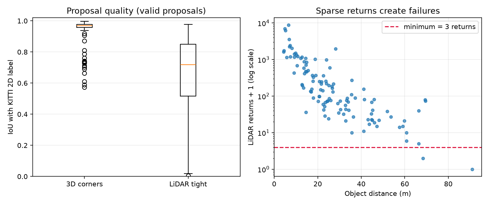
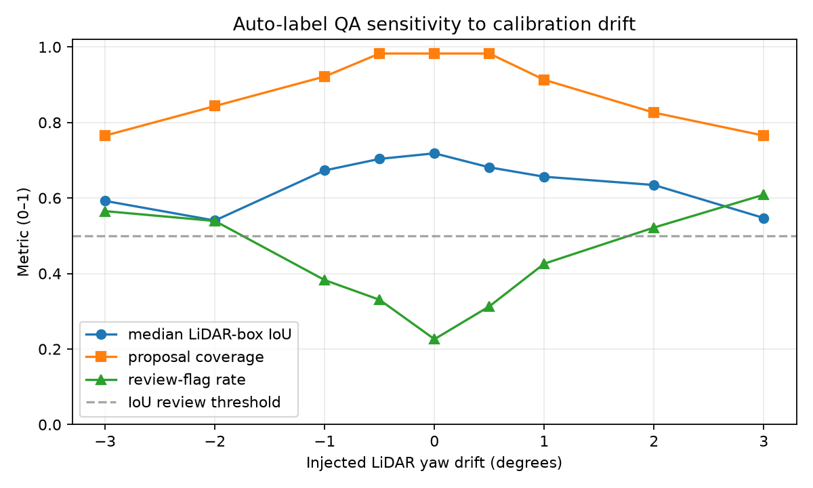
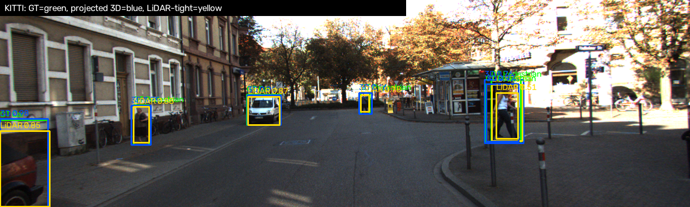
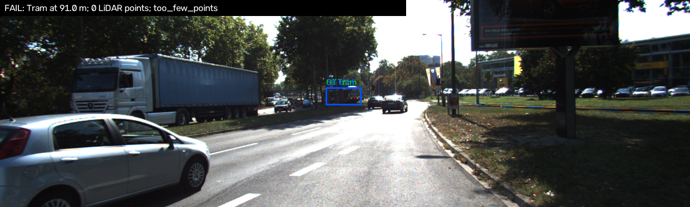

# Báo cáo Day 6: QA nhãn 2D từ box 3D và điểm LiDAR

- **Họ tên:** Nguyễn Minh Dương
- **MSSV:** 2A202602920
- **Lớp:** Cohort 4 - Level 3 - Track 4
- **Link repo:** `https://github.com/minhduong814/NguyenMinhDuong-2A202602920-Track4-Day21`
- **Topic:** F — Auto-label support
- **Dataset:** `data/kitti_mini` (KITTI Vision Benchmark Suite)
- **Các frame đã dùng:** toàn bộ 20 frame: 000001, 000004, 000007, 000008, 000009, 000010, 000011, 000012, 000015, 000016, 000019, 000021, 000023, 000025, 000031, 000032, 000043, 000048, 000049, 000061.

## 1. Claim

Trên 115 object của KITTI mini, box 2D từ 8 góc box 3D đạt median IoU **0,970**, cao hơn box chặt từ điểm LiDAR (**0,718**, trên các proposal hợp lệ).
Với box LiDAR và ngưỡng review IoU < 0,5, lệch calibration yaw **+1°** làm tỷ lệ bị gắn cờ tăng từ **22,6% lên 42,6%**, đồng thời coverage giảm từ **98,3% xuống 91,3%**.
Vì vậy box từ góc 3D là baseline tạo nhãn ổn định hơn; box LiDAR nên dùng như tín hiệu QA và luôn có fallback khi điểm thưa.

## 2. Evidence

Thí nghiệm là deterministic (không dùng phép lấy mẫu ngẫu nhiên), giữ nguyên ảnh, label và ngưỡng tối thiểu 3 điểm; chỉ thay đổi yaw extrinsic. CSV đầy đủ: `results/autolabel_objects.csv`, `results/autolabel_drift_objects.csv`, `results/autolabel_drift_summary.csv`.

| Cấu hình | Coverage | Median IoU | Tỷ lệ review |
|---|---:|---:|---:|
| 8 góc box 3D, 0° | 100,0% | 0,970 | 0,0% |
| Điểm LiDAR, 0° | 98,3% | 0,718 | 22,6% |
| Điểm LiDAR, −1° | 92,2% | 0,673 | 38,3% |
| Điểm LiDAR, +1° | 91,3% | 0,656 | 42,6% |
| Điểm LiDAR, +3° | 76,5% | 0,547 | 60,9% |







Màu xanh lá là 2D GT, xanh dương là envelope của 8 góc 3D, vàng là box từ điểm LiDAR trong box 3D. Ảnh nguồn: KITTI Vision Benchmark Suite.

## 3. Failure case

Frame `000016`, Tram cách camera **91,0 m**, occlusion level 2: không có điểm LiDAR nào nằm trong box 3D nên phương pháp LiDAR không thể tạo proposal; trong khi cách 8 góc vẫn đạt IoU **0,941**.
Nguyên nhân gốc thuộc lớp **Geometry**: mật độ góc hữu hạn khiến vật xa/che khuất không nhận được return; điều kiện tối thiểu 3 điểm ở lớp **Preprocess** biến sự thưa điểm thành missing label.
Khi triển khai cần log số điểm/object theo khoảng cách, gắn cờ ngay khi `< 3`, và fallback sang box từ 8 góc hoặc đưa người gán nhãn review thay vì coi missing proposal là background.



## 4. Khuyến nghị nếu triển khai thật

Use-case phù hợp là QA/gợi ý nhãn offline cho dữ liệu camera–LiDAR của ADAS: dùng box 8 góc làm proposal chính, còn IoU/coverage của box LiDAR làm tín hiệu phát hiện calibration drift.
Ngưỡng IoU 0,5 nhạy với drift nhưng baseline đã gắn cờ 22,6%, nên không được tự động loại nhãn chỉ bằng ngưỡng này; cần kết hợp distance, occlusion, truncation và số điểm.
Hệ thống nên log phân phối IoU, coverage, số điểm/box, khoảng cách, tỷ lệ review theo frame và xu hướng theo thời gian; cảnh báo khi các chỉ số lệch khỏi baseline theo camera/sensor.
Đánh đổi: review nhiều tăng an toàn nhãn nhưng tốn nhân lực; giảm ngưỡng tăng throughput nhưng có thể bỏ sót calibration drift nhỏ.

## 5. Cách chạy lại

Chạy từ thư mục gốc của repo; lệnh `src.autolabel` tái tạo toàn bộ CSV và hình trong `results/` từ 20 frame KITTI.

```bash
python -m pip install -r requirements.txt
python tools/verify_data.py --data-root data/kitti_mini
python -m unittest discover -s tests -v
python -m starter.projection --data-root data/kitti_mini --frame 000011
python -m src.autolabel --data-root data/kitti_mini --out-dir results
python tools/check_submission.py
```

## 6. Khai báo sử dụng AI

| Công cụ | Dùng cho việc gì | Tôi đã kiểm chứng thế nào |
|---|---|---|
| OpenAI Codex | Hỗ trợ cài đặt projection, xây pipeline Topic F, viết unit test, chạy thí nghiệm và biên tập báo cáo | Đọc lại code và công thức; chạy 6 unit test; verify 80/80 file KITTI; chạy lại pipeline trên đủ 20 frame; đối chiếu CSV với biểu đồ và xem trực tiếp ảnh demo/failure |
